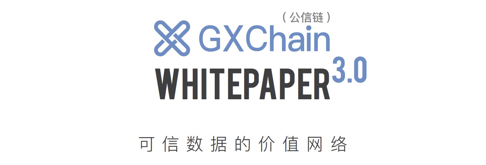
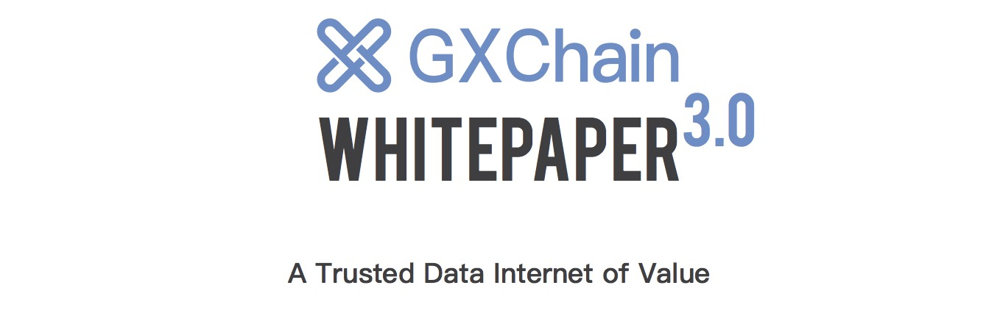

# GXChain White Paper

  
    
  
  
    
  

## Abstract

GXChain is a fundamental blockchain for the global data economy, designed to build a trusted data internet of value.

GXChain has evolved rapidly since its inception, which started from a decentralized data marketplace (commercialized on September 2017), to a basic-chain ecosystem. The ecosystem is currently serving millions of users and software developers. 

To help people better understand what we are doing now, and where we are going in the future, we are continuously updating the whitepaper of GXChain. 

This version of the whitepaper focuses on the following topics:

- Elaborated GXChain’s governance structure, which can faciliate democratic, transparent and decentralized governance of GXChain. GXChain is growing from the early stage of team operation to the community-based governance, further improving consensus.
- Introduced the GXChain TrustNodes election, and earnings. The election campaign will make GXChain more distributed, improving the security and stability of the GXChain main net. Influential teams in the world will be introduced to the election campaign and participate in the governance of GXChain.
- Optimized technical and system structure of GXChain and the addition of smart contracts 2.0, cross chain technology, oracle machines, and trusted data modules. We also give examples of the applications of a trusted data internet and our technical strategies, thereby setting guidelines for developers.
- Announced to swap GXS to GXC with a ratio of 1:1, GXC will be the core asset and act as the main token for utility and governance of GXChain. Later, in the GXChain ecosystem, GXC will be the key utility token for payments, transactions, governance, and development.
- Illustrated business models of GXC, and its value, generation, and distribution mechanism.
- Announced the road map of GXChain, which focuses on improving its competitiveness through technical innovation, collaboration, and community governance.

## 引言

GXChain( 公信链 ) 是一条为全球数据经济服务的基础链，旨在打造可信数据的价值网络。

本项目自 2016 年正式成立以来，经历了快速的发展，已经从创立之初一个基于区块链的去中心化数据交易所（已于 2017 年正式上线且商用），进化成为一个服务着数百万用户和开发者的基础链，从服务于一个具体的数据业务场景进化到服务于全球数据经济。

为了适应项目的不断进化，让关注本项目的社区用户、开发者和同业研究者对 GXChain 有全貌式的理解，我们在不断升级更新项目的白皮书，力求对项目的发展现状和未来方向有及时且客观的呈现。

本次 3.0 版本的 GXChain ( 公信链 ) 白皮书，在以下几个方面有重要更新：

- 明确了 GXChain 的治理架构，推进主链治理的民主、透明和去中心化，这标志着 GXChain已经度过了早期的团队运营阶段，逐渐向社区化治理过渡，有助于进一步扩大和凝聚共识。
- 公布了 GXChain 的节点竞选规则和收益方案，竞选机制将带来节点的分散，提升主网出块的稳定和安全，后续节点竞选正式启动，也将引入全球有技术和社区号召力的团队融入 GXChain生态参与竞争和治理，提升 GXChain 的全球影响力。
- 以更清晰的方式梳理和呈现了 GXChain 的系统层次结构和技术方案，重点阐述了智能合约2.0、预言机、跨链等合约层设计和实现，介绍了可信数据组件多个组成部分的技术方案，对GXChain 可信数据价值网络的业务场景进行了举例说明，为开发者提供了落地应用开发的场景指导。
- 将原有基于 GXChain 发行的 Token — GXS，1:1 自动替换为 GXC，GXC 将作为 GXChain的主链核心资产 (Core Asset)，成为 GXChain 最重要的治理和应用通证，后续 GXChain 生态中治理、开发、应用、支付流通场景均以核心资产 GXC 为媒介。
- 系统阐述了 GXC 的经济模型、价值、产出及分发机制，明确了 GXC 的价值内涵和成长空间。
- 公布了 GXChain 后续的技术开发路线图，聚焦主线任务提升 GXChain 在技术上的竞争力，同时便于社区监督开发进度和开发者加入协作。

